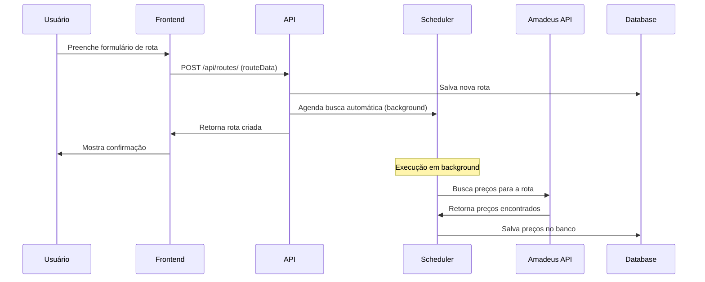
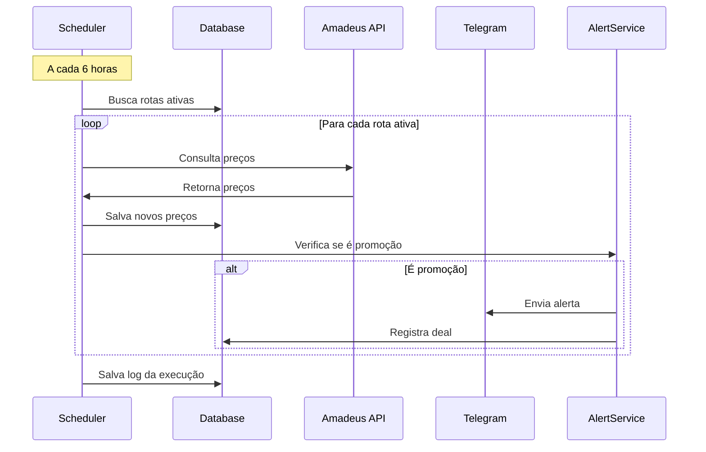

# 📖 Documentação Técnica - Flight Watcher v1.0.0

## 🏗️ Arquitetura do Sistema

### Visão Geral

O Flight Watcher é construído com uma arquitetura moderna e modular, separando responsabilidades entre camadas bem definidas:

```
┌─────────────────┐    ┌─────────────────┐    ┌─────────────────┐
│   Frontend      │    │    Backend      │    │   Serviços      │
│   (Bootstrap)   │◄──►│   (FastAPI)     │◄──►│   Externos      │
│                 │    │                 │    │                 │
│ • Dashboard     │    │ • REST API      │    │ • Amadeus API   │
│ • Rotas         │    │ • Models        │    │ • Telegram Bot  │
│ • Promoções     │    │ • Scheduler     │    │ • SQLite DB     │
└─────────────────┘    └─────────────────┘    └─────────────────┘
```

### Componentes Principais

#### 1. 🎨 Frontend (Interface Web)

- **Tecnologia**: Bootstrap 5 + JavaScript ES6+
- **Responsabilidades**:
  - Interface de usuário responsiva
  - Comunicação com API REST
  - Validação de formulários
  - Feedback visual em tempo real

#### 2. 🚀 Backend (API REST)

- **Tecnologia**: FastAPI + SQLAlchemy + Pydantic
- **Responsabilidades**:
  - Endpoints REST para CRUD
  - Validação de dados
  - Lógica de negócio
  - Agendamento de tarefas

#### 3. 🔌 Serviços Externos

- **Amadeus API**: Dados de voos e preços
- **Telegram Bot**: Notificações em tempo real
- **SQLite**: Persistência de dados

## 📊 Modelo de Dados

### Entidades Principais

#### Route (Rota)

```python
class Route(Base):
    id: int                    # Identificador único
    origin: str(3)            # Código IATA origem (ex: GRU)
    dest: str(3)              # Código IATA destino (ex: JFK)
    start: date               # Data início monitoramento
    end: date                 # Data fim monitoramento
    active: bool              # Status ativo/inativo
    created_at: datetime      # Data de criação
    updated_at: datetime      # Última atualização
```

#### Price (Preço)

```python
class Price(Base):
    id: int                   # Identificador único
    route_id: int             # FK para Route
    day: date                 # Data do voo
    value: float              # Preço encontrado
    created_at: datetime      # Quando foi coletado
```

#### JobLog (Log de Execução)

```python
class JobLog(Base):
    id: int                   # Identificador único
    started_at: datetime      # Início da execução
    finished_at: datetime     # Fim da execução
    status: str               # success/error
    routes_processed: int     # Quantidade de rotas processadas
    prices_found: int         # Preços encontrados
    error_message: str        # Mensagem de erro (se houver)
```

### Relacionamentos

```
Route (1) ──── (*) Price
  │
  └── JobLog (*) (através de processamento)
```

## 🔄 Fluxos de Funcionamento

### 1. Criação de Rota com Busca Automática



### 2. Monitoramento Automático (Scheduler)



### 3. Detecção de Promoções

```python
def is_deal(new_price: float, historical_prices: List[float]) -> bool:
    """
    Lógica para detectar promoções:
    1. Calcula média dos últimos 30 dias
    2. Verifica se novo preço está X% abaixo da média
    3. Considera apenas se há histórico suficiente (>= 5 preços)
    """
    if len(historical_prices) < 5:
        return False

    avg_price = sum(historical_prices) / len(historical_prices)
    discount_percent = ((avg_price - new_price) / avg_price) * 100

    return discount_percent >= settings.deal_threshold_percent  # 10%
```

## 🛠️ Configuração e Deploy

### Variáveis de Ambiente

```bash
# .env
AMADEUS_CLIENT_ID=seu_client_id_aqui
AMADEUS_CLIENT_SECRET=seu_client_secret_aqui
AMADEUS_ENV=test  # ou production

TELEGRAM_BOT_TOKEN=seu_token_aqui
TELEGRAM_CHAT_ID=seu_chat_id_aqui

DEBUG=true
JOB_INTERVAL_HOURS=6
DEAL_THRESHOLD_PERCENT=10
```

### Estrutura de Configuração

```python
class Settings(BaseSettings):
    # App
    app_name: str = "Flight Watcher"
    app_version: str = "1.0.0"
    debug: bool = True

    # Database
    database_url: str = "sqlite:///prices.db"

    # Amadeus
    amadeus_client_id: str
    amadeus_client_secret: str
    amadeus_env: str = "test"

    # Telegram
    telegram_bot_token: Optional[str] = None
    telegram_chat_id: Optional[str] = None

    # Scheduler
    job_interval_hours: int = 6
    job_jitter_seconds: int = 600

    # Alerts
    deal_threshold_percent: int = 10
```

## 📡 API REST - Endpoints Detalhados

### Rotas (`/api/routes/`)

#### `POST /api/routes/` - Criar Rota

**Request Body:**

```json
{
  "origin": "GRU",
  "dest": "JFK",
  "start": "2025-12-15",
  "end": "2025-12-20",
  "active": true
}
```

**Response:**

```json
{
  "id": 1,
  "origin": "GRU",
  "dest": "JFK",
  "start": "2025-12-15",
  "end": "2025-12-20",
  "active": true
}
```

**Comportamento:**

1. Valida códigos IATA (3 caracteres)
2. Verifica se datas são futuras
3. Evita rotas duplicadas
4. Inicia busca automática em background

#### `GET /api/routes/` - Listar Rotas

**Query Parameters:**

- `skip`: int (offset para paginação)
- `limit`: int (máximo de resultados)
- `active_only`: bool (apenas rotas ativas)

#### `GET /api/routes/{id}/prices` - Preços da Rota

**Response:**

```json
[
  {
    "day": "2025-12-15",
    "value": 1299.99,
    "created_at": "2025-08-21T10:30:00"
  }
]
```

#### `POST /api/routes/{id}/search-prices` - Busca Manual

Inicia busca de preços sob demanda para uma rota específica.

### Preços (`/api/prices/`)

#### `GET /api/prices/chart/{route_id}` - Dados para Gráfico

**Response:**

```json
{
  "labels": ["2025-12-15", "2025-12-16"],
  "prices": [1299.99, 1199.99],
  "average": 1249.99
}
```

### Status (`/api/status/`)

#### `GET /api/status/health` - Health Check

**Response:**

```json
{
  "status": "healthy",
  "timestamp": "2025-08-21T10:30:00",
  "service": "Flight Watcher API"
}
```

#### `GET /api/status/stats` - Estatísticas

**Response:**

```json
{
  "total_routes": 5,
  "active_routes": 3,
  "total_prices": 45,
  "total_deals": 2,
  "last_job_run": "2025-08-21T04:00:00",
  "system_status": "operational"
}
```

## 🔧 Serviços e Integrações

### AmadeusService

```python
class AmadeusService:
    def __init__(self):
        self.client = Client(
            client_id=settings.amadeus_client_id,
            client_secret=settings.amadeus_client_secret,
            hostname="test" if settings.amadeus_env != "production" else "production"
        )

    def get_cheapest_price(self, day: date, origin: str, dest: str) -> Optional[float]:
        """
        Busca o menor preço para uma rota em uma data específica

        Parâmetros da API Amadeus:
        - originLocationCode: Código IATA origem
        - destinationLocationCode: Código IATA destino
        - departureDate: Data em formato ISO (YYYY-MM-DD)
        - adults: Número de adultos (fixo em 2)
        - currencyCode: Moeda (BRL)
        - max: Máximo de ofertas retornadas (20)
        """
```

### TelegramService

```python
class TelegramService:
    def send_deal_alert(self, route: Route, price: float, discount_percent: float):
        """
        Envia alerta de promoção formatado:

        🛫 PROMOÇÃO ENCONTRADA!

        ✈️ GRU → JFK
        📅 15/12/2025
        💰 R$ 1.199,99 (15% OFF)

        [Ver Detalhes]
        """
```

### SchedulerService

```python
class SchedulerService:
    def __init__(self):
        self.scheduler = AsyncIOScheduler()

    def start_scheduler(self):
        """
        Agenda job principal:
        - Intervalo: 6 horas (configurável)
        - Jitter: 10 minutos (evita sobrecarga)
        - Persistência: JobLog para auditoria
        """
        self.scheduler.add_job(
            func=self.monitor_prices_job,
            trigger="interval",
            hours=settings.job_interval_hours,
            jitter=settings.job_jitter_seconds,
            id="monitor_prices"
        )
```

## 🎨 Frontend - Componentes JavaScript

### RoutesManager

```javascript
class RoutesManager {
  constructor() {
    this.routes = [];
    this.filteredRoutes = [];
  }

  async addRoute() {
    // 1. Coleta dados do formulário
    // 2. Valida no frontend
    // 3. Envia para API
    // 4. Inicia monitoramento de busca
    // 5. Atualiza interface
  }

  async loadRoutePrices() {
    // Carrega preços para cada rota exibida
    // Atualiza cards com menor preço encontrado
  }

  async searchPrices(routeId) {
    // Busca manual com feedback visual
    // Spinner durante busca
    // Atualiza resultado após 10s
  }
}
```

### API Helper

```javascript
class API {
  static async get(url) {
    const response = await fetch(url);
    if (!response.ok) throw new Error(`HTTP ${response.status}`);
    return response.json();
  }

  static async post(url, data) {
    const response = await fetch(url, {
      method: "POST",
      headers: { "Content-Type": "application/json" },
      body: JSON.stringify(data)
    });
    if (!response.ok) throw new Error(`HTTP ${response.status}`);
    return response.json();
  }
}
```

## 🚀 Performance e Otimizações

### Database

- **Índices**: Criados em campos frequentemente consultados
- **Constraints**: UniqueConstraint para evitar duplicatas
- **Relacionamentos**: Lazy loading para otimizar queries

### API

- **Paginação**: Implementada em endpoints de listagem
- **Validação**: Pydantic para validação rápida e consistente
- **Background Tasks**: Processamento assíncrono para busca de preços

### Frontend

- **Lazy Loading**: Preços carregados sob demanda
- **Debouncing**: Evita múltiplas requisições simultâneas
- **Caching**: Estados mantidos durante sessão

## 🔒 Segurança

### Validação de Dados

- **Backend**: Pydantic schemas com validação rigorosa
- **Frontend**: Validação dupla para UX melhor
- **Sanitização**: Códigos IATA automaticamente em maiúsculo

### Rate Limiting

```python
# Amadeus API tem limites:
# - Test: 10 requisições/segundo
# - Production: Conforme plano contratado
#
# Implementação de retry com backoff exponencial
max_retry = 3
backoff_base = 2
```

### Logs e Auditoria

- **Todos os jobs**: Registrados em JobLog
- **Erros**: Logados com stack trace completo
- **Performance**: Tempo de execução monitorado

## 📈 Monitoramento e Métricas

### Health Checks

- `/api/status/health`: Status básico da aplicação
- `/api/status/stats`: Métricas detalhadas do sistema

### Logs Estruturados

```python
logger.info(f"Busca iniciada para {route.origin}->{route.dest}")
logger.debug(f"Preços encontrados: {len(prices)}")
logger.error(f"Erro na API Amadeus: {error}")
```

### Métricas de Sistema

- Total de rotas ativas
- Preços coletados nas últimas 24h
- Promoções encontradas no mês
- Taxa de sucesso das buscas

## 🔄 Versionamento e Deploy

### Versão Atual: 1.0.0

- ✅ CRUD completo de rotas
- ✅ Busca automática de preços
- ✅ Interface web responsiva
- ✅ Sistema de alertas
- ✅ API REST documentada

### Roadmap v1.1.0

- 🔄 Múltiplas companhias aéreas
- 📧 Alertas por email
- 📊 Gráficos avançados
- 🌍 Suporte a múltiplas moedas

### Deploy

```bash
# Ambiente de desenvolvimento
python main_api.py

# Ambiente de produção (recomendado)
uvicorn main_api:app --host 0.0.0.0 --port 8000 --workers 4
```

## 📋 Troubleshooting

### Problemas Comuns

#### 1. Amadeus API não funciona

- ✅ Verificar credenciais em `.env`
- ✅ Confirmar environment (test/production)
- ✅ Checar rate limits da API

#### 2. Scheduler não executa

- ✅ Verificar logs em `logs/flightbot.log`
- ✅ Confirmar timezone do servidor
- ✅ Validar configurações de intervalo

#### 3. Telegram não envia

- ✅ Verificar token do bot
- ✅ Confirmar chat_id correto
- ✅ Bot deve ser iniciado pelo usuário

### Debug Mode

```python
# config.py
debug: bool = True  # Ativa logs detalhados

# Logs extras em desenvolvimento
if settings.debug:
    logging.basicConfig(level=logging.DEBUG)
```

---

**Documentação gerada para Flight Watcher v1.0.0**  
_Última atualização: 21/08/2025_
